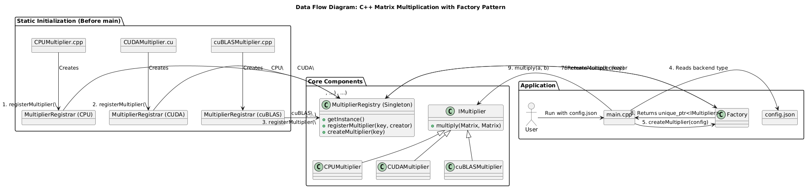
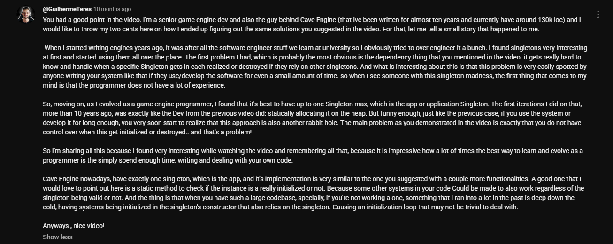

Based on the following repository - [cpp-design-patterns](https://github.com/AkeelMedina22/cpp-design-patterns)

## Background

I was recently browing [this](https://github.com/amdazm05/libtransform.cc) repository on Github, and was inspired to do something similar. I hadn't written C++ in over 2 years, since taking a course in GPU-Accelerated Computing. But, with my Masters starting in a few months, I decided to start looking in to Modern C++. I noticed this library had some interesting usage of `static`, and it was the first thing I wanted to investigate. I went down a rabbit hole of the static-initialization order, [this](https://www.youtube.com/watch?v=IMZMLvIwa-k&list=LL&index=19) video by The Cherno (I got through my course on OOP 5 years ago because of him!), and a hefty conversation with Gemini about Meyers Singleton and the Factory Creational Pattern. 

Keeping these sources in mind, I had an idea for a project that played to my strengths. Having recently done an assignment on GPU matrix multiplication, I thought I'd make a similar library to `libtransform.cc` but just for matrix multiplication, and use more robust design patterns. One key thing I noticed was that although it featured a Singleton pattern, it wasn't enforced by deleting the constructor and assignment operator, but it also allocated memory for the object, manually assigned it using an `init()` function, and did not delete it.

This was touched upon in The Cherno's video, about how good it is to have an explicit starting and ending point for the object. At first I didn't really understand what the issue was with the Meyers Singleton, and since I'm writing this in hindsight, the resulting library I made is an over-engineered mess, but I think that it's good that I learned about this early in my journey. 

Anyways, if you're new to C++ as well, this might not make too much sense right now, and if you're an experienced C++ dev, you probably know exactly what I mean, but regardless, I'll explain in more detail soon.

-----

## Definitions

I'll give some definitions of some terms I'll be using throughout just in case anyone is unfamiliar with them.

- Static -> A keyword in C++ that controls the lifetime or visibility of a variable or function:
    - `static` variable inside a function -> The variable is initialized only *once*. It persists for the entire duration of the program in the **Data/BSS segment**. The word static means fixed in place, and the memory location of a static variable (inside a function) is fixed in the Data segment across the lifetime, unlike a stack variable in a function that would have a new memory address each time.
    - `static` global variable/function -> This is an unintuitive overload of the keyword that is used outside of a function, in global scope. It keeps the *visibility* of a variable or a function private in it's translation unit (the .cpp file). By default, a global variable has **external linkage** meaning it can be shared across the program, in other translation units. By declaring it as static, it is *statically* confined to this one file.
    - Static-Initialization -> A phase during program startup where the compiler and loader allocate memory for all global and static variables and give them their initial values. This all happens **before** the main function begins to execute.
    - Static-Initialization Order Fiasco -> A C++ problem where the order of initialization for static variables across different source files is not guaranteed. If one global static object depends on another from a different file, it might try to use it before it's been constructed, leading to undefined behavior.
- Singleton ->  A design pattern that restricts a class to a single instance and provides a global point of access to it. Useful for managing shared resources like a logger or configuration settings. A classic Singleton is created at program start using *static initialization*.
    - Meyers Singleton -> A specific implementation of the Singleton in C++. It uses a static variable inside a function to create the instance. This approach is thread-safe in C++11+, and avoids the "static-initialization order fiasco" by creating the object on its first use rather than at program start. This is also known as **Lazy Initialization**.
- Registry Pattern -> A pattern that creates a global lookup service where objects can register themselves by a key (`std::string`). It's often implemented as a Singleton.
- RAII (Resource Acquisition Is Initialization) -> A core C++ concept where you tie the lifecycle of a resource (like memory, file handles, or network sockets) to the lifetime of an object. The resource is acquired in the object's *constructor* and released in its *destructor*. This guarantees that resources are properly cleaned up, even in the face of exceptions. One convenient way to ensure RAII is by only using C++ smart pointers.
    - `std::unique_ptr` -> A smart pointer that provides exclusive ownership of a dynamically allocated object. It automatically deletes the managed object when the `unique_ptr` goes out of scope, which demonstrates RAII.
- Interface (Abstract Base Class) -> A class that defines a "contract" for other classes to follow. It cannot be instantiated itself but ensures that any derived class implements its required functions.
- Polymorphism -> Allows objects of different types to be treated through a common interface. For instance, a function can work with a pointer to a base class, and the correct derived class's method will be called automatically.
- Eigen -> A C++ template library for linear algebra: matrices, vectors, numerical solvers, and related algorithms.
- AVX2 (Advanced Vector Extensions 2) -> All modern CPUs have vector processing capabilities through specific SIMD registers. AVX2 is an instruction set for x86 processors that performs these vectorized operations using special SIMD 'intrinsics`, since the compiler's auto-vectorization can only handle very trivial cases.
- OpenMP -> An API for writing multi-threaded code. It simplifies parallel programming by allowing you to add compiler directives (#pragmas) to your code to parallelize loops and other regions.
- CUDA -> An API that allows using the GPU for general-purpose computations (GPGPU). 
- cuBLAS (CUDA Basic Linear Algebra Subroutines) -> A highly optimized NVIDIA library for performing linear algebra operations (like matrix multiplication) on a GPU. It provides a simple way to get maximum performance for common tasks without writing custom GPU code.

-----

## System Walkthrough

To expand on the project idea, what I had in mind from the user perspective was this: if I want to create a multiplier, lets say it uses CUDA and a tiling approach, and then I want to compare it with my custom multiplier which handles memory bank conflicts, how can i do this as easily as possible, and then measure performance of all of them in one program. *I know*, that's a pretty random user story. But I just wanted to learn how to utilize C++ design patterns to get some actual programming experience. Now even in hindsight, I'm not certain what the best design to execute this project would be, I'm fairly convinced my design does not scale for large projects but atleast in the short term, I think it is pretty neat.

Based on the definitions, here is a rough overview of the data flow. The user begins by telling the factory to create a multiplier based on a config path. Now the factory will do the config parsing and its job is to return the correct multiplier object with whatever parameters it needs. For design purposes, to make it extensible in case the user wants to create his own class, we delegate the creation to a Registry. We have a specification (a `std::string`), and the Registry holds the instructions on how to produce it. So, the registry has a private variable that holds these recipes, which is of this type: `std::map<std::string, std::function<std::unique_ptr<IMultiplier>()>>`. A map where the key is the input specification string, and output is the function that gives the object we need. Perfect!

At this point, you might be wondering, "Wait, when did you fill out that map?" That's because we rely on **static initialization** to trigger the map's population before `main` even begins. While the Meyers Singleton for the `MultiplierRegistry` is designed for lazy initialization (i.e., on first use), we force this initialization to happen early using *global* `MultiplierRegistrar` objects. Remember, we previously defined static-initialization allocating memory for **both** global and static variables on program start. Each multiplier's `.cpp` file defines one of these global objects. When the program starts, these registrars are constructed, and their constructors call `MultiplierRegistry::getInstance().registerMultiplier(...)`. This guarantees our registry is fully populated before we need it. The `MultiplierRegistry` singleton itself, being a static object, is then automatically destroyed when the program exits.

For clarity, I asked Gemini to generate a diagram based on the data flow, and it did a pretty good job!

Walking through this diagram, we can see the program starts with the `_Multiplier.cpp` files registring its Multiplier type to a `MultiplierRegistrar` Object. Specifically, I've implemented 3 options: A simple CPU multiplier that uses the optimized Eigen matrix multiplication, a custom CUDA kernel implementing tiled matrix multiplication, and a cuBLAS `cublasSgemm` multiplier. 

The registrar is a helper class of sorts that acts as an intermediary to the registry. We can see arrows from all of them go to the core Meyers singleton `MultiplierRegistry` (using the `registerMultiplier()` function). This all happens before `main` has started. The Registry singleton exists, and has all possible multipliers registered and ready for use by the user. 

On program start, the user can request the Factory for the Multiplier it wants using a config. The user will only need to worry about the `IMultiplier` abstract base class, not the extra classes we provide. This leads to a predictable `multiply()` class function that will have to be implemented for each inheriting class.  

-----

### How to Add a New Multiplier

The main reason I chose this design was for extensibility. Let's see it in action. Say I want to create a new, highly-optimized CPU multiplier that uses both OpenMP and AVX2 intrinsics, to see if I can beat Eigen's performance.

Here’s how to add a custom multiplier to the existing repository:

**Step 1: Define the Header**

First, I'll create `omp_avx2_multiplier.hpp` and define the class, making sure it inherits from our `IMultiplier` interface.

```cpp
#pragma once
#include "matrix_transform/interfaces.hpp" 

namespace MatrixTransform {

    class OMPAVX2Multiplier : public IMultiplier {
    public:
        Matrix multiply(const Matrix& a, const Matrix& b) override;
    };

} // namespace MatrixTransform
```

**Step 2: Implement the Logic and Register It**

Next, in `ompavx2_multiplier.cpp`, I'll write the actual matrix multiplication logic. But the most important part is the two lines of code that register this new class with our `MultiplierRegistry`. 
P.S, I didn't use the fused multiply add command because for some extremely confusing reason, I consistently got a `target specific option mismatch` error. Despite having the write compile time flags and includes. I even installed a newer GCC but it was still omnipresent. 

```cpp
#ifdef WITH_OMPAVX2

#include "logger.hpp"
#include "ompavx2_multiplier.hpp"
#include "multiplier_registry.hpp"
#include <Eigen/Dense>
#include <chrono>
#include <omp.h>

namespace MatrixTransform {

    // This global object's constructor registers our new multiplier before main() even starts.
    namespace { 
        MultiplierRegistrar OMPAVX2Registrar( 
            "OMP_AVX2",
            []() -> std::unique_ptr<IMultiplier> { 
                return std::make_unique<OMPAVX2Multiplier>();
            }
        );
    }
    
    Matrix OMPAVX2Multiplier::multiply(const Matrix& a, const Matrix& b) {
        // ...
        #pragma omp parallel for
        for (int i = 0; i < a.rows(); ++i) {
            for (int j = 0; j < b_T.rows(); ++j) {
                __m256 sum_vec = _mm256_setzero_ps();

                int k = 0;
                for (; k <= a.cols() - 8; k += 8) {
                    __m256 a_vec = _mm256_loadu_ps(&a(i, k));
                    __m256 b_vec = _mm256_loadu_ps(&b_T(j, k));

                    __m256 prod_vec = _mm256_mul_ps(a_vec, b_vec);
                    sum_vec = _mm256_add_ps(sum_vec, prod_vec);
                }

                float sum_arr[8];
                _mm256_storeu_ps(sum_arr, sum_vec);
                float result = sum_arr[0] + sum_arr[1] + sum_arr[2] + sum_arr[3] +
                            sum_arr[4] + sum_arr[5] + sum_arr[6] + sum_arr[7];
                
                for (; k < a.cols(); ++k) {
                    result += a(i, k) * b_T(j, k);
                }
                
                c(i, j) = result;
            }
        }
    }
    // ...
    
} // namespace MatrixTransform

#endif
```

**Step 3: Update the Config**

Finally, I just need to tell the factory to use my new backend. I'll create a new config file or just edit the existing one to use the key `"OMP_AVX2"`.

```json
{
  "backend": "OMP_AVX2",
  "log_level": "debug"
}
```

And that's it. After recompiling, the program will use my new multiplier without any changes to the Factory, Registry, or `main.cpp`. This is exactly the reason for using a Registry, rather than just a Factory. While a registry isn't really a specific design pattern or such like a Factory or a Singleton, the reason that we don't just keep the Factory as the base point is so that if you add a new multiplier, you don't have to edit any *existing* code. For example, when I first started with this project, each multiplier existed, but in the Factory class I would have to include a new `if` statement to check if the config backend matched the multiplier. I'd also need to include its header files in the code. It would look something like this:

```cpp
#include "factory.hpp"
#include "cpu_multiplier.hpp"  
#include "cuda_multiplier.hpp"
#include "cublas_multiplier.hpp"
#include "omp_avx2_multiplier.hpp" // <- Must add this include for a new type

// ...

std::unique_ptr<IMultiplier> Factory::createMultiplier(const std::string& key) {
    if (key == "CPU") {
        return std::make_unique<CPUMultiplier>();
    } else if (key == "CUDA") {
        return std::make_unique<CUDAMultiplier>();
    } else if (key == "cuBLAS") {
        return std::make_unique<cuBLASMultiplier>();
    } else if (key == "OMP_AVX2") { // <- Must add this else-if for a new type
        return std::make_unique<OMPAVX2Multiplier>();
    }
    // ...
}
```

The `Factory` and `main` are completely decoupled from the concrete multiplier types using the Registry. They only operate on two things: the string key, and the abstract interface.

However, it should be noted that I've configured CMake to allow usage of CUDA, OpenMP, and Vectorization (using a string). A sample command to generate build files and run the program is:
```shell
mkdir -p build && cd build && cmake .. -DENABLE_OPENMP=ON -DVECTORIZATION_MODE=AVX2 -DENABLE_CUDA=ON && make && src/matrix_app ../src/config.json
```
If there is any custom multiplier added which requires any other library or API, the CMakeLists.txt will need to be updated accordingly. Also, any source file (`_.cpp`) would need to be added as well. 

-----

### Performance and Benchmarking

So, what was the point of all this? To easily swap out backends and test performance. I ran the application on a **1000x1000** matrix multiplication task and timed the execution for each backend.

Here are the results:

| Backend          | Time (ms) | Notes                                    |
| ---------------- | --------- | -----------------------------------------|
| `OMP`            | 13307     | 1 thread for 1 element in C (xSIMD)      |
| `CPU (Eigen)`    | 4675      | Optimized CPU implementation (xSIMD,xOMP)|
| `OMP_AVX2_CPU`   | 1028      | 1 thread for 1 element in C (SIMD)       |
| `CUDA`           | 547       | Custom tiled CUDA kernel                 |
| `cuBLAS`         | 48        | NVIDIA's optimized GPU library           |

Some notes on these results. As you saw in the custom implementation, I parallelized with OpenMP in such a way that 1 thread would be assigned to 1 element in the result matrix. Without SIMD, this performed quite terribly. But to be honest, I am surprised by the improvements with SIMD. I will probably make a short post about it, I had this idea that switching from normal dot products to doing 8 at once with SIMD would bring about a maximum of 8x performance improvement, but it is ~13x in this example. I have some ideas, while reading the book *Performance Analysis and Tuning on Modern CPUs* by Denis Bakhvalov, such as hardware prefetching, lesser memory stalls, etc., but it deserves its own post.

It's also important to note that these are just multiplication times. Both GPU implementations have some *relatively* significant time spent initializing the CUDA context and allocating memory on the GPU. Copying data to and from is relatively fast, around 5-15ms back since its just a single 1000x1000 matrix. But the initialization (maybe the memory allocation included?) costs around `1000ms`.  

-----

### Reflections and Future Work

This project was mainly an experiment for learning experience, and as I hinted at earlier, I don't think this design is a silver bullet. My main takeaway is that static initialization, while powerful, is a double-edged sword. It feels magical to anyone new, but its complexity makes the system hard for anyone else to understand easily, which is a major red flag for system design. You would likely feel it yourself while implementing it, like I did, especially when trying to explain how it works in documentation!

I found a comment on The Cherno's video from a senior game engine developer that explain this feeling I had while trying to center system design decisions around the Meyers Singleton. This design, with its reliance on static initialization order, feels fragile. What happens if this library is integrated into a much larger system that has its own `static` nightmares?



For a more robust and scalable system, I think I'd prefer the **Dependency Injection (DI)** framework in general. It's more verbose for the user, but it's also more explicit and stable. Instead of a factory hiding the creation, the user would create the object themselves and "inject" it into the part of the code that needs it. It also helps in writing complete unit tests. 

For example, `main.cpp` might look like this with DI:

```cpp
#include "matrix_transform/matrix_types.hpp"
#include "matrix_core/cublas_multiplier.hpp" // User directly includes what they need
#include <iostream>

//

int main() {
    // Parse config.json
    // Create Logger instance
    // etc.

    // The user explicitly creates the dependency.
    auto my_multiplier = std::make_unique<MatrixTransform::cuBLASMultiplier>(logger, config_options);
    
    // The dependency is "injected" into the function that needs it.
    run_benchmark(*my_multiplier);
    
    return 0;
}
```

Ultimately, I agree with the sentiment that if a pattern isn't robust enough for a large-scale project, there probably isn't a good reason to use it on a small scale either without significant benefit (which there isn't in this case). The Cherno's video discussed other ways to handle singletons that might be better than the Meyers approach, and I think exploring those options alongside DI would be the next logical step. However, I'll leave that for further exploration. For now, I think this exploration has been quite fruitful, and at the very least, I've grown more comfortable with how C++ developers think about design.

Thanks, and let me know if you have any feedback!
