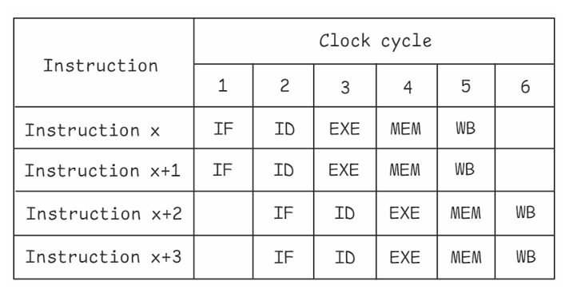

While reading *Performance Analysis and Tuning on Modern CPUs* by Denis Bakhvalov, I had a surprising realization. Before this book, I had a completely incorrect understanding of what a thread is. Somewhere in my mental model of CPU microarchitecture, the "thread" was a muddy concept that vaguely correlated to a physical core, but it was more of an abstraction. I never interacted much with them because of Python's horrendous GIL, and my main use case was in compute-bound workflows.

It turns out, understanding the "why" of threads requires looking at how a CPU executes instructions. Let's start there.

### Pipelining: The CPU's Assembly Line

This should be a familiar diagram for anyone who has taken a course in Computer Architecture. The classic 5-stage pipeline, shown above, describes the simplified process every instruction goes through on a CPU core. To be clear, this diagram implies the core has one of everything: one unit for fetching, one for decoding, one for executing, and so on.

But reality is more complex. A single thread will inevitably face **pipeline stalls**. Reading from memory, for instance, can take hundreds of cycles, leaving all those expensive hardware units sitting idle. To mitigate this, modern CPUs use 'Out-of-Order' (OoO) execution, which allows the core to find other independent instructions to work on while the slow one completes.

### Superscalar Architecture: Doing More at Once

Now here is the crucial insight. The architectural solution to stalls is what paves the way for multithreading. Modern CPUs can issue more than one instruction *in the same clock cycle*.

This is called **Instruction-Level Parallelism (ILP)**. A typical modern CPU has an issue width of 6 to 9, meaning it's equipped with multiple ALUs, FPUs, and Load/Store Units. The goal of all this hardware, combined with OoO execution and branch prediction, is to keep the core as saturated as possible with work from a single thread.

But even that is often not enough. **This is the problem SMT was designed to solve.** A single thread, no matter how optimized, will eventually stall waiting for data. Those stalls are wasted potential. By having a second thread ready to go, the core can hide the latency of the first. When Thread 1 stalls on a memory read, the scheduler can instantly feed instructions from Thread 2 into the pipeline, keeping the hardware busy.

### So, What *Is* a Thread?

This brings us back to the original question. From the hardware’s perspective, a thread is simply **an independent set of architectural states**. It has its own program counter and its own set of registers. A single physical core with SMT contains a single, shared pool of execution units (multiple ALUs, FPUs, etc.) but duplicates the state-management hardware (like registers and program counters). This allows the core to track two different instruction streams at once, presenting itself to the operating system as two "logical cores."

As you can see in the diagram below, threads do not map 1:1 to physical cores. They are a mechanism to better utilize the parallel hardware already built into a single core.

### Practical Implications: When SMT Helps and Hurts

Understanding this architecture is not just fascinating, but it has a direct consequences for performance.

**When is SMT a clear win?**
For workloads with high latency. If your code frequently waits for memory, disk I/O, or network responses, SMT provides a significant performance boost. While one thread is waiting, the other can be executing, effectively hiding the delay.

**When can SMT hurt performance?**
For tasks that are purely **compute-bound** and can already keep the execution units saturated. If two threads are competing for the same ALU, they aren't running in parallel, they are just getting in each other's way. Note how I said earlier that the execution units are **shared**. 

Worse, as you can see in the diagram's second-to-last row, if Thread 1 is extremely heavy, it can hog ALL of the execution units. Furthermore, since threads on the same core share the L1 and L2 cache, two compute-heavy threads can end up fighting for cache space. This causes **"cache thrashing,"** where the threads repeatedly evict each other's data from the cache, forcing slow reads from main memory and significantly hurting performance. This is why SMT is sometimes disabled for HPC tasks. However, it really depends on your application and your specific code.

### Conclusion

It’s important to keep the CPU's architecture in mind when writing multithreaded applications. Multicore programming is conceptually straightforward. More cores means more parallel work. But multithreading is more nuanced. It’s a latency-hiding technique, not a simple scalable model for parallel execution. By understanding when to use it, you can avoid performance pitfalls and write much more efficient code.

-----

**References**
  - *Performance Analysis and Tuning on Modern CPUs* - Denis Bakhvalov.

-----
Thanks for reading, and let me know if there are any errors\!