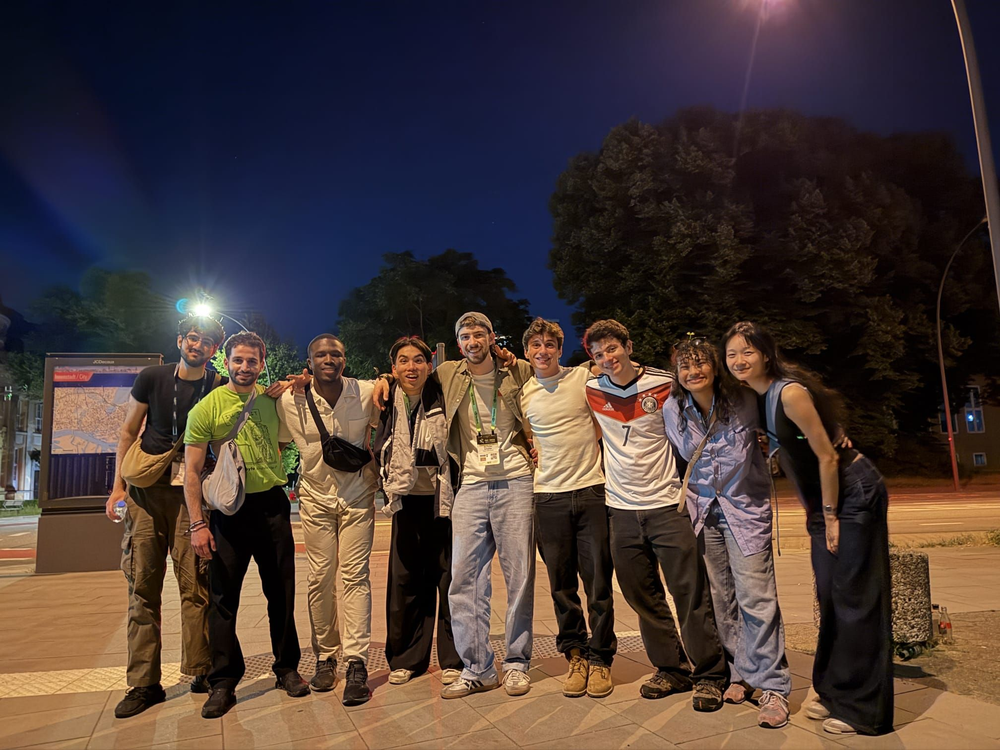

As a participant representing TeamEPCC in the ISC Student Cluster Competition 2026, I've recently had the chance to work on a custom-built HPC cluster that we shipped to Hamburg for the in-person competition. I wanted to give my overall reflections on the competition and my experience. 

The SCC has never included llama.cpp as a micro-benchmark, usually focusing on HPC-specific benchmarks like HPL and HPCG. This year introduced llama.cpp, which allows LLM inference with minimal setup on a wide range of hardware. It is a plain C/C++ implementation with no dependencies. It runs surprisingly well on Apple silicon! Understanding how to use llama.cpp is fairly simple, but maximizing performance for specific hardware could be a whole MSc thesis. The source code is very well written, and it is easy to find and read specific implementations of custom kernels. But the majority of performance comes from tuning the runtime parameters, so understanding the workload, and how those parameters change the character of your problem on your hardware, is what actually matters. That makes it quite different from the other benchmarks we were given, like HPL. 

HPL involves around 4 parameters, each of which can be tuned to achieve maximum performance on your hardware. The competition allows us to choose a matrix size for achieving this performance. llama.cpp will force you to understand a different question. How does your chosen model interact with llama.cpp's implementation of Flash Attention? How do your batch size and parallel sequence count impact your workload? How do different model types (MoE, Dense) interact with these parameters? This is an optimization problem, with many different parameters.

Prefill is compute-bound, decode is memory-bandwidth-bound. The KV cache grows with context length and eats HBM that your weights live in. A flag that doubles prefill throughput can halve decode throughput on the same run. The "right" answer requires careful observation, but your success likely depends on your knowledge of inference, not your familiarity with the tool. Specifically for the SCC, I find this interesting because I have found that your hardware would not necessarily determine your success on competition day. I've noticed this through nearly doubling throughput from understanding my workload better: dequantization overhead on cuBLAS kernels tanks decode throughput, because decode issues many small kernels in quick succession. Assigning MMQ kernels to decode and cuBLAS to prefill avoids this overhead, which is optimal for both prefill-heavy and decode-heavy workloads. I've spent the past month really diving deep into inference, understanding exactly what matters in production. I had coursework related to scaling up a ViT model, improving efficiency with PyTorch, and we often treated optimizations provided by PyTorch, like Flash Attention, as guaranteed wins. Surprisingly, I've found cases where FA quarters throughput. I avoided experimenting with parameters like batch size because I believed efficiency to be purely algorithmic, but I now realize I just did not understand the nature of ML serving back then.

A few weeks before the competition, they announced a new benchmark, FIO (Flexible IO Tester). There is much that can be done with this tool (hence, ```flexible```), so we guessed it would be sequential and parallel file read/write benchmarks. I picked BeeGFS to pool NVMe across the cluster into a single scratch mountpoint, striped across nodes for parallel throughput. Our cluster had an 8xH200 SXM5 GPU node with one 7TB RAID 6 NVMe drive, and 8 CPU nodes that each had their own 1TB NVMe drives, shared with the OS. The obvious plan was to treat every target the same, pooling all the NVMe together and letting BeeGFS stripe across it. However, this was not the right strategy. A real concern with sharing your storage drive with the OS is that pushing File IO to the limit can potentially crash the OS. I had to cap the storage daemon's bandwidth just to keep the CPU nodes from crashing. Now at this point, we had already sent our cluster to Hamburg; the shipping process took over a month! So the majority of this account took place over the 3 days of the competition, requiring many late nights. I realized at this point I could not rely on the NVMe drives attached to the CPU node, shared with the OS. On the day of the competition, we attached 4 self-provided 1.92TB HPE read-intensive NVMe SSDs to use as the actual storage targets. Once I striped a file across both storage tiers, the whole file's throughput dropped to whatever the throttled CPU targets could sustain since a parallel filesystem bottlenecks on the slowest target. Pulling the CPU nodes out of the stripe and running purely against the four fast SSDs took us from an aggregate of roughly 26 GB/s back up to a write/read split of about 10.4 and 21.5 GB/s, just over 31 GB/s combined. It was an interesting process, setting up BeeGFS from scratch, dealing with many software issues on the cluster itself. Not only were many CPU nodes damaged during transport, but all of them were partitioned incorrectly, with 90GB allocated rather than 900GB. The missing space needed to be reclaimed. The previous setup of ext4 for the entire drive was also suboptimal, which I later changed to XFS.

To summarize my thoughts, this SCC really tested whether you understand the system you are working with well enough to know where the bottleneck is. With llama.cpp, more compute didn't help if I didn't understand why prefill performed poorly by default. With BeeGFS, more NVMe didn't help if I didn't understand the target properties themselves. I learnt more about RDMA, InfiniBand, and cluster design than I expected when I first signed up! 

While that was the technical side, I cannot end this article without mentioning how great a time I had interacting with all of the teams at the SCC. Everyone, from all corners of the world, brought unique outlooks, ideas, and inspiration to the table. This was my first major conference I've attended, previously at IEEE Cluster 2025 in Edinburgh, but it was truly unique. For anyone reading this who is part of future SCC teams, please go to all the events! Talk to other teams! You will not regret it :)

